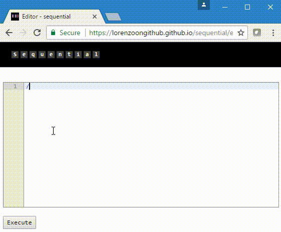

A website for presenting works on JavaScript

> Sometimes writing a few lines of JavaScript code is the best way to explain how something works. 

sequential is a complete client side solution for creating and sharing short snippets of JavaScript code.
Every snippet can access any external library and it records time of execution and details on the platform.
It can be re-run and modified.

